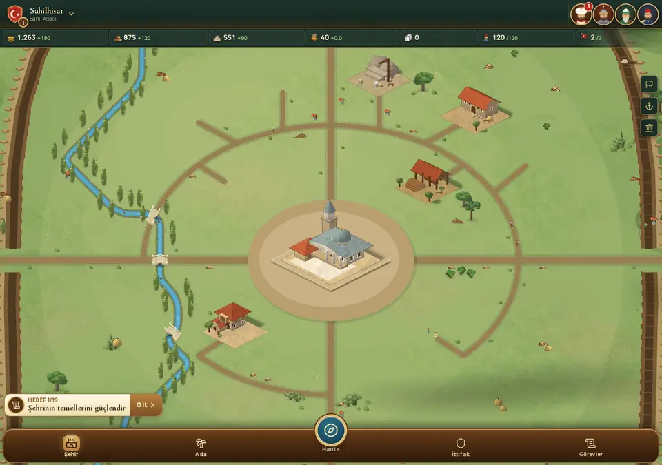
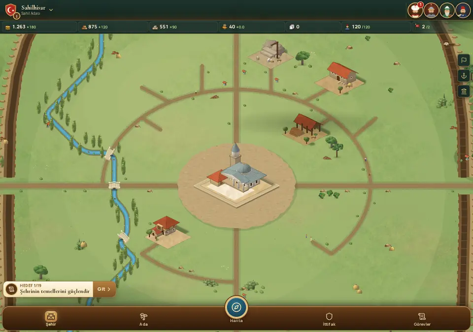
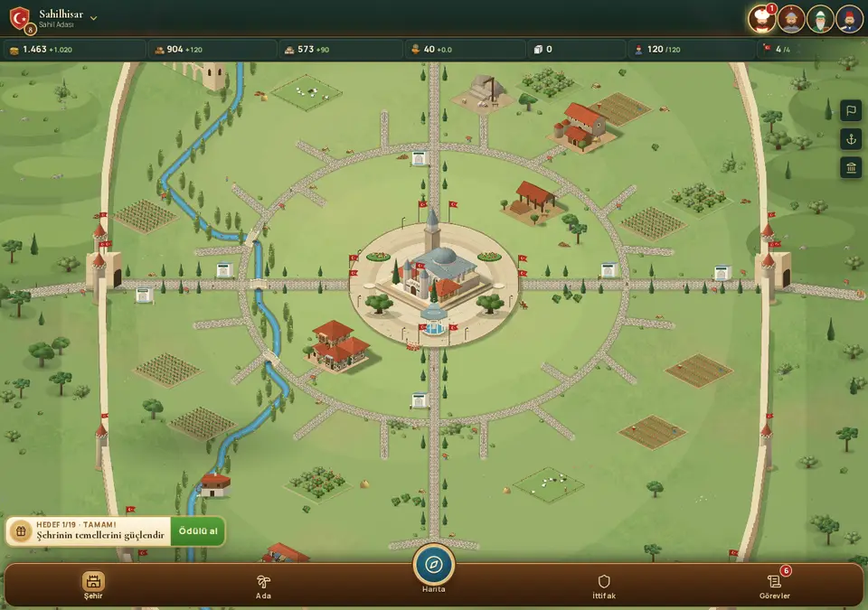
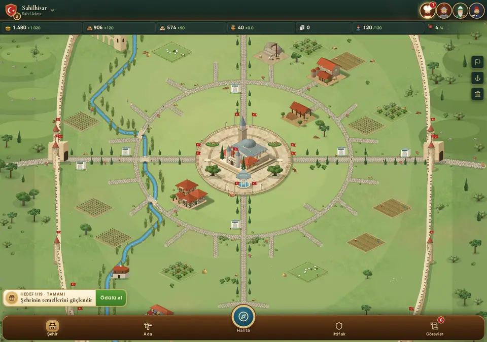
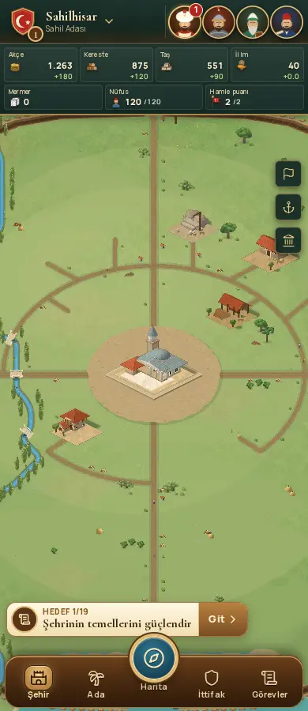
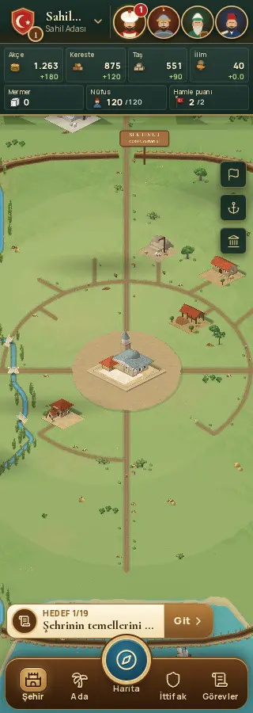
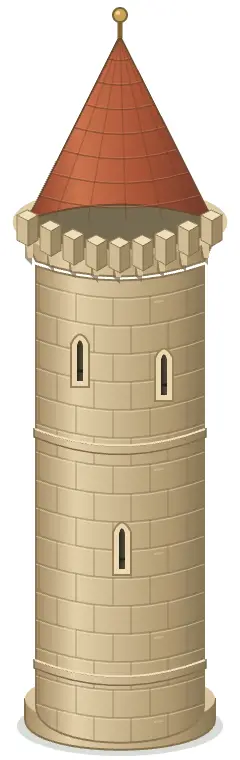

# Görsel tur: surlar, meydan ve mobil kaynak şeridi

Başlangıç: `565717a` (0.28.0). Güncel bina ve yol iyileştirmeleri korunarak hazırlanmıştır.

## Değişiklikler

- Sur kulesi yeniden çizildi: kavisli taş örgü, şaşırtmalı derzler, siperli galeri, ok yarıkları ve kiremit çatısı. Yeni SVG, mevcut kule konumları ve alt ankrajıyla yüklenir. Kaynak: `tools/art/wall-tower.mjs`; yeniden üretim: `node tools/art/wall-tower.mjs`.
- Sur yüzlerinde altı taş sırası, taşlar arasında hafif ton farkları, alt yüzey patinası, silme ve mazgalların yan yüzleri eklendi.
- Başlangıç meydanındaki iki düz oval yerine sabit tohumlu toprak dokusu, çakıl ve kenar otları çizildi. Gelişmiş meydanda büyük dilimler yerine şaşırtmalı taş döşemesi var. Mevcut seviyeye bağlı görünürlük korunur.
- Mobil kaynak şeridi dört ana kaynak ve üç şehir göstergesi olarak iki sıraya alındı. Kaynak adları görünür; negatif akçe üretimi kırmızı. Mevcut ekonomi ekranı aynı düğmeyle açılır.

Ekonomi, savunma hesabı, inşaat süreleri, kayıt şeması, bina yerleşimi, yol ağı, kapı açıklıkları ve etkileşim alanları değiştirilmedi. `terrain-builder.ts` değişikliği yalnızca meydan çizimidir. Yeni sanat, tarayıcıda çizilen vektör ve mevcut Phaser Graphics sistemini kullanır.

## Gerçek oyun görüntüleri

| Önce | Sonra |
| --- | --- |
|  |  |
|  |  |

| 390 px şehir | 320 px şehir | Yeni kule |
| --- | --- | --- |
|  |  |  |

## Kontrol

- Statik üretim derlemesi ve TypeScript: başarılı.
- Mevcut testler: 230/230 başarılı.
- Chromium ile gerçek oyun ekranı: 1280×900, 390×900 ve 320×900.
- Başlangıç şehri ve ayrı test kaydında Divanhane/Surlar seviye 8 görüntülendi. Test kaydı sadece geçici tarayıcıda kullanıldı.
- Mobilde yedi sayaç görünür; sayaç içeriği ve sayfa yatay taşmıyor. Ekonomi düğmesi açılıyor.
- Sayfa hatası ve başarısız varlık isteği yok.

Fiziksel Android cihazda APK performansı bu turda ölçülmedi.
